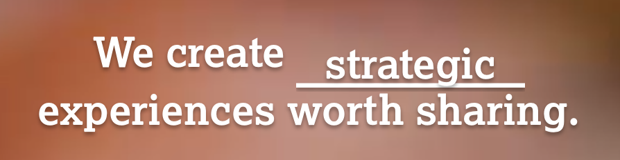
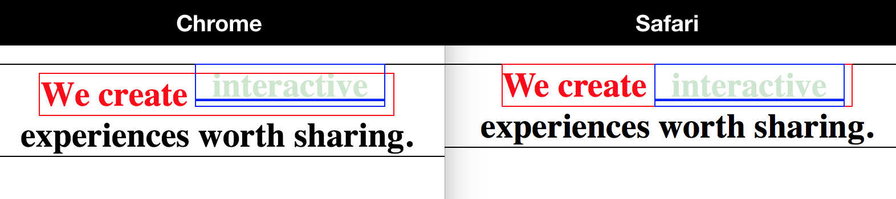
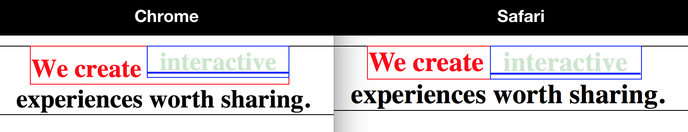
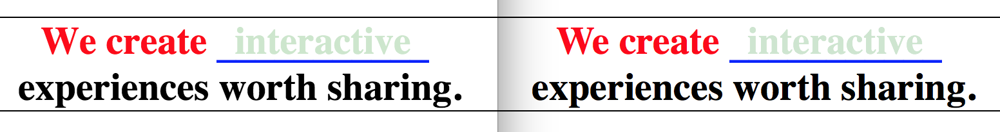

## Analysis of a CSS Positioning Bug
### Description
The web site of an online development firm (we'll call it “Sunny Interactive”) uses a CSS animation to fade/scroll in/out an array of different words onto a blank line. It’s an impressive little bit of code that looks cool on the screen, but there’s a small problem—while it looks great in the latest versions of Google Chrome and Firefox:


...unfortunately, Safari (being an Apple product) has to go and "[Think Different](https://youtu.be/tjgtLSHhTPg)."

It seems that Safari disagrees with the other browsers regarding the proper positioning of the animated text, placing it much lower than the rest of the text on the same line:



### Analysis
So, what's going on here, exactly? In order to see the problem more clearly, let’s take the existing code and simplify it a bit:

```html
<!DOCTYPE html>
<html>
  <head>
    <link rel="stylesheet" href="css/before.css" charset="utf-8">
  </head>
  <body>
    <div>
      <h1>
      	<span class="rotating-line">
      	We create
      		<span class="rotating-words">
      		  <span>interactive</span>
      		  ___________
      		</span>
      	</span>
      	<br>experiences worth sharing.
      </h1>
    </div>
  </body>
</html>
```
```css
* {
	padding : 0;
	margin  : 0;
}
body {
	margin-top : 2em;
}
h1 {
	text-align : center;
	font-size  : 30px;
	outline    : 1px solid black;
}
.rotating-line {
	display  : inline;
	position : relative;
	color    : red;
	outline  : 1px solid red;
}
.rotating-words {
	display    : inline-block;
	position   : relative;
	overflow   : hidden;
	color      : blue;
	outline    : 1px solid blue;
	line-height: 1.2;
}
.rotating-words span {
	position   : absolute;
	overflow   : hidden;
	white-space: nowrap;
	width      : 100%;
	opacity    : 0.2;
	color      : green;
	outline    : 1px solid green;
}
```

Here's what that code looks like rendered in Chrome and Safari, side by side:



#### Discussion
Having stripped away extraneous detail, commented out existing positioning adjustments, and added colors and borders for clarity, we can now see the problem more clearly.

Safari, it turns out, is rendering the code pretty much exactly as indended, but in Chrome, the box outlined in red (the span with the `rotating-line` class) is pushed down away from its enclosing element while the blue-outlined box (`rotating-words`) isn't.

Looking at the CSS `display` rules gives us some idea why: The outer red box is set to `inline`, while the inner blue box is set to `inline-block`. Perhaps this is where the browsers disagree? Differing interpretations on how to render an `inline-block` element nested inside an `inline` element on the same line?

Since we know we **need** the inner span to be `inline-block` (the fact that `inline-block` is white-space aware is what allows the underline effect to work), our first option should perhaps be to see what happens when we also set the enclosing element to `inline-block`.



Aha! Now both the red box **and** the blue box are aligned with the top of the black box. But what about that extra space at the bottom of the red box, now?

Well, that one took a little bit of experimentation, but eventually I found that if we add a `vertical-align: bottom;` rule to the `rotating-words` class, it'll work itself out. (No idea, why, really, but it does work, so I won't argue.)

The final touch would be to tweak the standard positions of the `rotating-words` and the underline beneath them by slightly adjusting their `top` and/or `bottom` properties.



There. Perfect!

### Recap & Step-by-Step Fix
To fix the one tiny flaw in their otherwise stellar web site, all the good people of Sunny Interactive need do is:

1. Change the display property on `.rotating-line` from `inline` to `inline-block`.
2. Remove all existing position-adjusting rules.
3. Add the following rules:
	- `.rotating-words { vertical-align: bottom; top: 0.1em; }`
	- `.rotating-words span { bottom: 0.01em; }`
